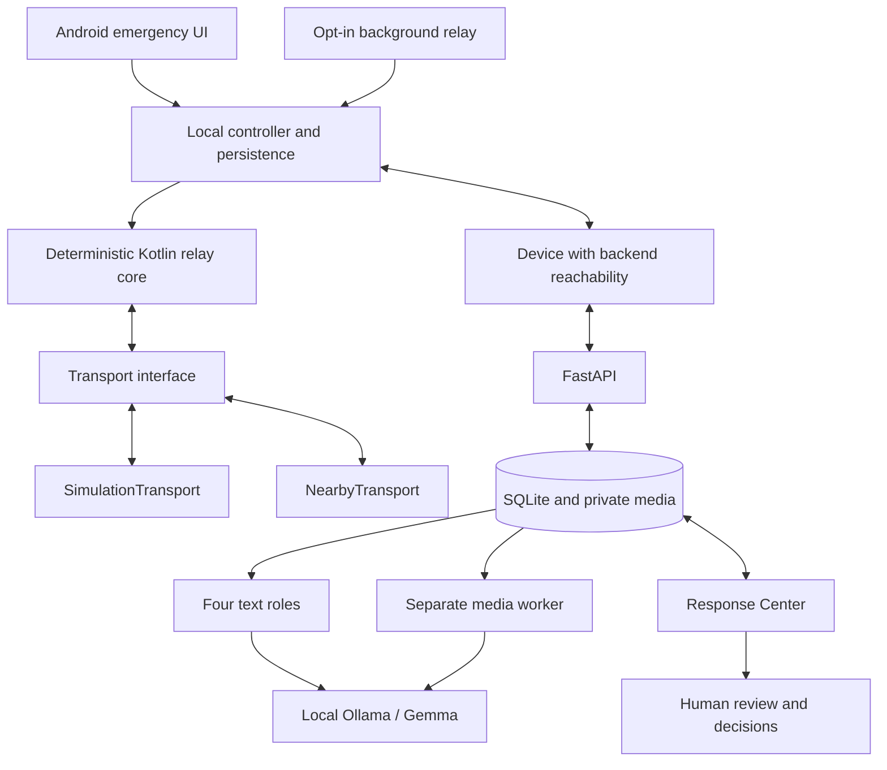

# ResQMesh

**An SOS should survive a lost connection.**

ResQMesh is an Android emergency-reporting prototype designed for connectivity disruptions. A person can ask for help using a short voice message, photo, video, structured selections or text. The app saves the report on their device and forwards it through participating nearby devices as connections become available. Any device that reaches the response server can upload it. Responders review the original evidence alongside local AI suggestions.

Built for **Hacktoberfest Hack Day Bengaluru — October 4, 2026**. The current demo runs on one development machine with an Android Emulator, FastAPI, SQLite and local Ollama inference. The mobile and dashboard interfaces are English; submitted evidence retains its original language.

**Status:** the local software prototype is implemented. Simulation exercises the shared relay engine, but does **not** demonstrate real Bluetooth/Wi-Fi communication. Physical multi-phone relay and camera testing remain open. ResQMesh is not an official emergency service and does not guarantee delivery, response or rescue.

[Architecture](docs/ARCHITECTURE.md) · [Demo walkthrough](docs/DEMO.md) · [Testing](docs/TESTING.md) · [API](API.md) · [Android guide](android/README.md)

## The problem

During a flood, fire or other disruption, a person may have no Internet connection and may be unable to type. A useful report needs to remain available when a link disappears, carry what the person actually provided, and distinguish “saved on my phone” from “received by the response system.”

ResQMesh combines store–carry–forward messaging with a responder workspace. Every participating phone must run ResQMesh. It cannot reach arbitrary nearby phones, and a report with no available route stays local. Devices and links are dynamic; the application has no fixed A → B → C → D path or permanently assigned gateway.

## What is implemented

| Area | Behavior |
| --- | --- |
| Emergency reporting | Direct voice/photo/video actions; optional structured needs, text and location; reviewed detailed SOS; explicit confirmation for a general SOS. |
| Local persistence | Room-backed reports and receipts, resumable media chunks, encrypted drafts and submission recovery using the same report UUID. |
| Relay core | Deterministic Kotlin logic for duplicate detection, observed paths, hop/expiry limits, peer storage acknowledgements and retries. |
| Two transports | Editable virtual-device graph through `SimulationTransport`; Google Nearby Connections integration through `NearbyTransport`. Physical radio behavior is not yet verified. |
| Media delivery | Small SOS envelopes travel before attachments; size/SHA-256 checks, independent media uploads and explicit saved-media playback. |
| Delivery evidence | Separate local save, peer storage, backend receipt and human acknowledgement. A receipt must return to the source before its screen claims that status. |
| Background operation | Opt-in foreground relay service, persistent notification with Stop, Android timeout handling and tap-to-resume reboot reminder. |
| Retention | Keep-all default; opt-in 7/30/90-day cleanup for sufficiently old confirmed-delivered copies. Pending reports and unconfirmed attachments are preserved. |
| Response Center | Paginated reports, search, selected-pair correlation review, verification signals, gateway presence, original media and audited human decisions. |
| Local AI | Four text-processing roles plus a separate durable media-analysis worker. Original evidence and human decisions remain separate from AI output. |
| Local access controls | Optional viewer/responder/admin accounts, expiring sessions and separate scoped gateway keys; a local demo/shared-key mode is also available. |

Opening a capture, draft or review screen does not send an SOS. Voice has an explicit **Stop & send SOS** action; photo and video show a preview before sending. Unknown location remains a valid, visible state. Report history is paginated, and Home shows only the latest report.

## How it fits together



The four text roles share one model with separate prompts and validated structured outputs:

1. **Intake:** extracts source-supported details, uncertainty and missing information.
2. **Correlation:** proposes related reports for a human to review.
3. **Verification:** assesses observable reporting patterns and suggests verification steps.
4. **Triage:** suggests urgency, response categories and questions.

The media worker separately transcribes/interprets uploaded audio, images and sampled video. Its output records provenance and coverage and is labelled unverified. AI never chooses forwarding hops, automatically merges incidents, decides final truth, acknowledges an SOS or dispatches responders. A model error remains visible; it is not replaced with a canned answer.

## Run locally

Prerequisites:

- Python **3.12** and a virtual environment.
- [Ollama](https://ollama.com/download) with the configured `gemma4:e2b` model.
- FFmpeg and ffprobe on the backend's `PATH` for media analysis.
- [Android Studio](https://developer.android.com/studio), Android SDK platform **35**, platform tools, an emulator system image and **JDK 17**. The app supports Android API 26 and later.

The commands below use a macOS/Linux shell. Clone the repository and create the backend environment:

```sh
git clone https://github.com/venupyneni07/resqmesh.git
cd resqmesh
python3.12 -m venv .venv
.venv/bin/python -m pip install -r backend/requirements.txt
```

Start Ollama in one terminal if it is not already running:

```sh
ollama serve
```

In another terminal, download the model once and start the local demo:

```sh
ollama pull gemma4:e2b
.venv/bin/python scripts/demo.py start
.venv/bin/python scripts/demo.py status
```

Open **[Response Center](http://127.0.0.1:8000)**. The launcher binds the backend to loopback by default and starts local Ollama if needed. Initial SDK, dependency and model downloads need Internet access; subsequent local inference does not require a cloud AI account.

Open `android/` in Android Studio, select JDK 17 for Gradle, install SDK platform 35, create an emulator and run the `app` configuration. The Android Emulator reaches the host backend at **`http://10.0.2.2:8000`**; configure that origin under **Settings → Connection setup**. `localhost` inside Android refers to Android itself.

To build from a terminal with `JAVA_HOME` and `ANDROID_HOME` configured:

```sh
cd android
./gradlew :app:assembleDebug
adb install -r app/build/outputs/apk/debug/app-debug.apk
```

Use **Simulation Mode** for the one-machine demo. The [walkthrough](docs/DEMO.md) explains offline storage, automatic forwarding, an actual HTTP upload and returned receipts.

Runtime data is created locally in `backend/data/`; launcher logs and PIDs are in `.runtime/`. These files, credentials, captures and build artifacts are excluded from source control. Retain your database between sessions when you want to preserve history.

### Configuration

| Setting | Default / purpose |
| --- | --- |
| `OLLAMA_BASE_URL` | `http://127.0.0.1:11434` |
| `OLLAMA_MODEL` | `gemma4:e2b`; provider/model changes must be explicit. |
| `OLLAMA_TIMEOUT_SECONDS` | `180`; inference request timeout. |
| `RESQMESH_DB_PATH` | Override the backend SQLite path, especially for isolated tests. |
| `RESQMESH_FFMPEG`, `RESQMESH_FFPROBE` | Optional executable paths when absent from `PATH`. |
| `RESQMESH_API_TOKEN` | Optional shared local-demo key. |
| `RESQMESH_AUTH_DB_PATH` | Enable the separate local account/gateway-key database; manage it with `scripts/accounts.py`. |

The repository includes an optional deployment configuration, but the hackathon workflow is local. No public emergency service or cloud deployment is claimed. See [deployment notes](docs/DEPLOYMENT.md) for that separate scope.

## Test the software

From the repository root:

```sh
.venv/bin/python -m pytest backend/tests -q
```

From `android/`:

```sh
./gradlew :app:testDebugUnitTest :app:lintDebug :app:assembleDebugAndroidTest
```

Android instrumentation requires an emulator or device. Follow the [Android testing guide](android/README.md#build-and-verification) for installation with data preservation. Use an isolated backend database for live-model and HTTP rehearsals: these tests create explicitly synthetic reports. Ordinary automated tests use controlled test doubles where appropriate; passing them is not evidence of live model accuracy.

**Recorded checks, October 4, 2026:** the latest backend suite passed **140 tests**, with one upstream Starlette deprecation warning. The Android baseline passed 50 Kotlin JVM tests and 12 distinct emulator tests; lint had zero errors and 33 warnings. That snapshot covered SOS review, capture navigation, encrypted saved-media playback, draft/submission recovery, foreground-service lifecycle, enlarged text/landscape layouts and synthetic media relay through simulated peers to a real HTTP backend. Test sources are included under [`backend/tests/`](backend/tests/) and [`android/app/src/`](android/app/src/). See [Testing and evidence](docs/TESTING.md) for repeatable backend, browser, Android and real-model checks. Rerun them for the current revision; dated counts do not establish coverage of every later change.

The current `media-review-v2` pipeline rejects truncated/incomplete model output and permits an empty transcript with explicit uncertainty. In an isolated real-model check, replayed YouTube audio captured through the host microphone completed with an **empty transcript, unknown language and unknown urgency**; it did not recover intelligible speech. A known synthetic speech fixture matched its expected words. Capture and upload were verified, but these results do **not** establish accurate live transcription, sound classification or emergency interpretation. Earlier image hallucinations and missed/misclassified sounds also remain relevant limitations.

## Repository map

```text
android/                 Native Android app, shared relay core, transports and tests
backend/                 FastAPI API, SQLite stores, security, AI workers and dashboard
  static/                Locally served HTML, CSS, JavaScript and icon notices
  tests/                 Backend, browser and opt-in real-model checks
scripts/                 Local launcher, account management and synthetic rehearsals
docs/                    Architecture, demo, media review and validation plans
deploy/                  Optional deployment configuration
API.md                   Request, response and receipt contract
LICENSE                  MIT license for original ResQMesh code
```

| Read next | Contents |
| --- | --- |
| [Architecture](docs/ARCHITECTURE.md) | Boundaries, message flow, delivery semantics, AI, storage and trust. |
| [Demo](docs/DEMO.md) | Reproducible local judge walkthrough and expected failure states. |
| [API](API.md) | Report formats, media endpoints, receipts and operator actions. |
| [Android](android/README.md) | Build, capture flows, transport behavior and instrumentation. |
| [Media AI](docs/MEDIA_AI.md) | Decoding limits, provenance, retries and interpretation limitations. |
| [Testing and evidence](docs/TESTING.md) | Reproducible test commands and the dated verification snapshot. |
| [Physical test plan](docs/PHYSICAL_TEST_PLAN.md) | Actual Nearby/radio acceptance criteria. |
| [Usability checks](docs/USABILITY-AND-LANGUAGE-CHECKS.md) | English UI, accessibility checks and a real-user rehearsal plan. |

`Open ResQMesh Assistant.command` and `scripts/project_assistant.py` optionally open a local project-guide chat using [`docs/PROJECT_ASSISTANT_CONTEXT.txt`](docs/PROJECT_ASSISTANT_CONTEXT.txt). This guide is a documentation snapshot, separate from the emergency agents. It has no live database access and cannot send reports or dispatch help.

## Limits that matter

- **Connectivity:** every hop needs a participating compatible device. No route means no delivery. Physical Nearby discovery, range, multi-phone behavior and camera capture are not validated by the emulator.
- **Background execution:** the foreground-service option is subject to Android transfer windows, force-stop, Doze and manufacturer restrictions. Sustained field operation remains untested.
- **Evidence and identity:** anonymous origins do not establish independent witnesses. Byte hashes check file integrity, not whether an event is real. Relayed backend receipts are unsigned in this prototype.
- **Privacy:** Android Keystore protects durable payloads and credentials, while routing/index metadata remains readable. Private plaintext capture, assembly, preview and upload files can exist. This is not full-database or end-to-end encryption, and migration is not secure erasure of OS snapshots.
- **AI and response:** interpretations can be wrong or fail. Human acknowledgement is not rescue dispatch or an ETA. Representative emergency-user testing and real TalkBack acceptance remain open.

## Dependencies and attribution

Original ResQMesh code uses [MIT](LICENSE). The project uses SDKs and official API patterns, not a fork of an existing messaging app. Principal direct dependencies are below; transitive components retain their own notices.

| Component | Version | Published license / terms | Purpose |
| --- | --- | --- | --- |
| Kotlin | 1.9.24 | Apache-2.0 | Android and relay logic |
| AndroidX Room | 2.6.1 | Apache-2.0 (Maven POM) | Persistence |
| AndroidX Activity / Lifecycle | 1.9.3 / 2.8.7 | Apache-2.0 | Reactive native UI |
| Kotlin coroutines | 1.8.1 | Apache-2.0 | StateFlow and lifecycle collection |
| Google Play services Nearby | 19.3.0 | [Android SDK license](https://developer.android.com/studio/terms.html), declared by its Maven POM | Official radio transport |
| Android Gradle Plugin / Gradle | 8.6.1 / 8.10.1 | Apache-2.0 | Build tooling |
| FastAPI / Pydantic | 0.142.2 / 2.13.5 | MIT | API and validation |
| Uvicorn / HTTPX | 0.54.0 / 0.28.1 | BSD-3-Clause | HTTP service/client |
| SQLite | Platform runtime | Public domain | Backend state/work queue |
| Lucide icons | Bundled SVG/vector subset | [ISC](backend/static/icons/LICENSE) | Offline Android and dashboard icons |
| Ollama | 0.35.1 on prepared Mac | [MIT](https://github.com/ollama/ollama/blob/main/LICENSE) | Inference runtime |
| Gemma 4 E2B | `gemma4:e2b` (mutable registry tag) | [Apache-2.0](https://ai.google.dev/gemma/docs/core/model_card_4) | Four AI roles |
| JUnit / AndroidX Test / pytest | Pinned in build files | EPL-1.0 / Apache-2.0 / MIT | Tests |

Nearby is an official Google SDK dependency, not Apache-licensed ResQMesh source. Google's [overview](https://developers.google.com/nearby/connections/overview), [strategies](https://developers.google.com/nearby/connections/strategies), [permissions](https://developers.google.com/nearby/connections/android/get-started) and [dependency catalog](https://developers.google.com/android/guides/setup) were checked October 4, 2026. This project pins Nearby 19.3.0 and targets SDK 35. SDK upgrades must revisit permission requirements and radio behavior.
