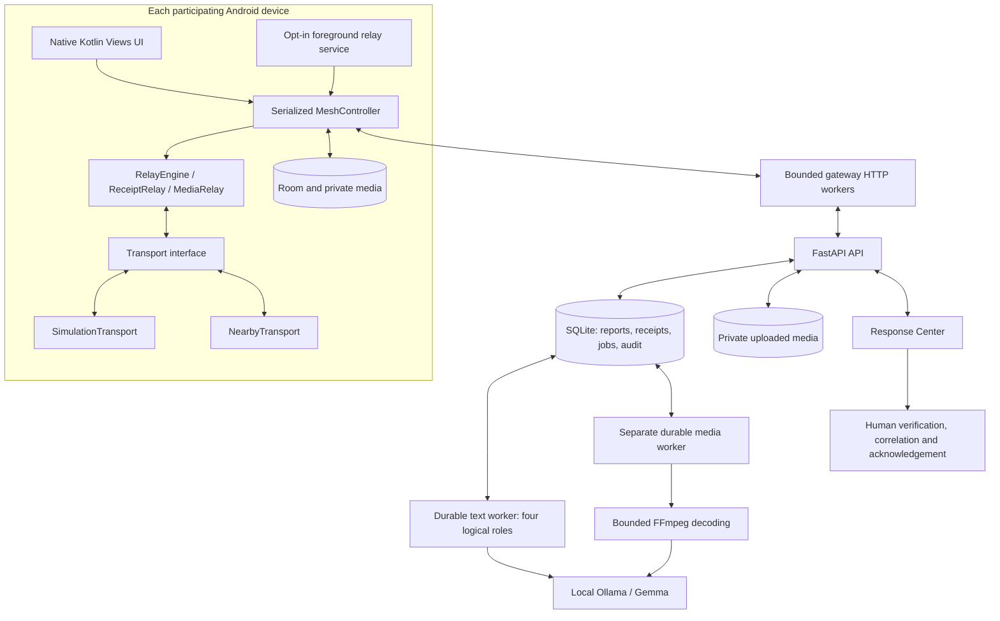
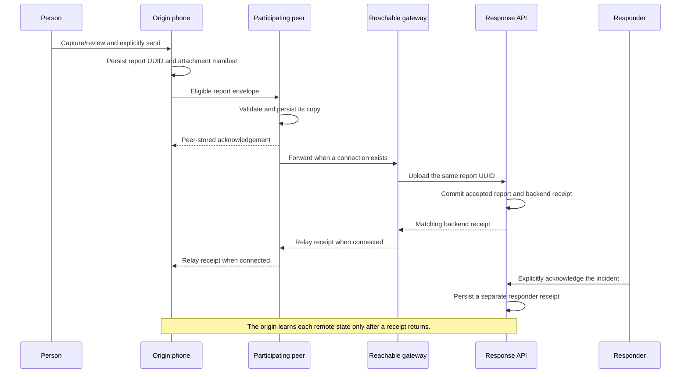

# ResQMesh architecture

ResQMesh separates transport-independent emergency messaging from radio integration and AI-assisted response. The phone owns its durable report copies and its local knowledge of delivery. The backend owns accepted originals, processing jobs and operator decisions. A simulator changes the network around the same Kotlin relay core.

The current implementation runs locally for a hackathon. The Android and Response Center interfaces are English. Evidence, including a reporter's original text or an AI transcript, keeps its source language.

## Components and ownership

| Boundary | Responsibility | Source |
| --- | --- | --- |
| Mobile UI | Capture, review, explicit send, local status and operator-controlled settings. | [`MainActivity.kt`](../android/app/src/main/java/org/resqmesh/app/MainActivity.kt) |
| Device coordinator | Serialize local changes, publish immutable state, manage connectivity and gateway work. | [`MeshApplication.kt`](../android/app/src/main/java/org/resqmesh/app/MeshApplication.kt) |
| Relay core | Deterministic envelope, receipt and media forwarding rules. | [`core/`](../android/app/src/main/java/org/resqmesh/app/core/) |
| Radio adapter | Discovery, peer authentication, connections and packet transfer. | [`NearbyTransport.kt`](../android/app/src/main/java/org/resqmesh/app/transport/NearbyTransport.kt) |
| Durable device storage | Report/receipt payloads, structured journeys, encrypted credentials and media. | [`data/`](../android/app/src/main/java/org/resqmesh/app/data/) |
| API and backend store | Validate input, persist accepted originals and receipts, expose response workflows. | [`app.py`](../backend/app.py), [`store.py`](../backend/store.py) |
| Text processing | Queue four logical roles against local model inference. | [`worker.py`](../backend/worker.py), [`ai.py`](../backend/ai.py) |
| Media processing | Validate/decode bounded uploaded media and maintain a separate analysis queue. | [`media.py`](../backend/media.py), [`media_analysis.py`](../backend/media_analysis.py) |
| Operator access | Optional individual accounts, roles, sessions and scoped gateway keys. | [`security.py`](../backend/security.py) |

There is one backend application with SQLite. No additional agent framework, MCP integration, message broker or microservice platform is required.

## Report lifecycle

The sequence illustrates one possible route. Devices are not permanently assigned these roles, and a connected network can produce a shorter or different path.

### Local knowledge, not global progress

An SOS is stored locally before forwarding. A peer acknowledges only after accepting its persisted copy. Each receive adds the receiving device to the observed path. The report UUID remains the same across copies; relayed copies do not create additional witnesses.

The normal mobile UI reads the selected device's stored reports, observed peers and locally received receipts. It cannot inspect another simulated node's database to claim remote delivery. The explicitly labelled Simulation Lab can edit the virtual environment and change which node the user is viewing.

These states have distinct meanings:

| Evidence held by this device | Meaning |
| --- | --- |
| Saved locally | This device has a persisted report. |
| Peer-stored acknowledgement | A participating peer confirmed storing a copy. |
| `backend_received` receipt | The configured backend accepted this report; the receipt reached this device. |
| `responder_acknowledged` receipt | A responder explicitly acknowledged it; that separate receipt reached this device. |
| Attachment confirmation | This device observed backend confirmation for those media bytes. |

A successful SOS upload does not establish attachment delivery, human acknowledgement or rescue dispatch. A backend receipt that has not returned to the origin cannot update the origin's delivery claim.

### Bounded, deterministic forwarding

`RelayEngine` receives an injected clock, store and transport. It forwards eligible copies to connected peers, excluding nodes already in the path and peers known to have stored that report. Report validity, immutable-payload checks, UUID deduplication, hop limits and expiration bound propagation. The current mobile creation path uses a 30-minute forwarding lifetime and at most eight hops. Expiration stops forwarding; it does not erase the saved report.

The transport interface carries envelopes and typed control packets. `SimulationTransport` operates over an editable graph of independent nodes. `NearbyTransport` uses Google Nearby Connections `P2P_CLUSTER`, including permission/radio checks, discovery, authentication-code confirmation and retry behavior. The radio adapter can be tested and replaced without rewriting the core relay rules.

Receipt gossip uses receipt-ID deduplication and a separate observed return path, with its own bounds. Inventory exchange reduces repeated transfers. An LLM does not participate in any routing decision.

## A gateway is a temporary capability

Any device with an available network can attempt backend communication. A successful backend heartbeat establishes a time-limited reachability lease. OS network availability, validated Internet and actual response-system reachability remain separate observations.

The coordinator uses bounded network workers and rotating upload/receipt batches. Large media has a separate transfer worker so it cannot occupy the alert workers. Retry timing prevents a slow failing gateway from permanently starving later work. Changes to the configured server invalidate outstanding probe generations and gateway leases.

Multiple gateways may upload the same UUID. The backend validates consistency and keeps one original report; a conflicting payload with the same UUID is rejected. It commits the accepted report and its durable receipt together. The first accepted upload route remains evidence rather than a guessed shortest path.

## Media travels independently

The current capture UI attaches one recording or image per SOS. Schema v4 can represent up to three attachments, within its aggregate bound. Older report versions remain readable; text-only mobile reports use schema v3.

Capture limits are 30 seconds/1 MiB for AAC voice, 1 MiB for compressed JPEG and 15 seconds/8 MiB for MP4 video. Each attachment manifest includes its ID, MIME type, size, SHA-256 and duration where applicable. The alert and manifest go first. `MediaRelay` then sends bounded 16 KiB chunks, preserving partial progress separately for each node. A file becomes available only after its complete size and hash match.

Gateway media uploads begin after report acceptance and are confirmed independently. The backend preserves original files for human review. Hash matching proves byte integrity; it does not prove capture time, location, identity or truth.

Saved media is decrypted for preview only after an explicit open action. Foreground capture files and private preview/upload/assembly files have a different lifetime from durable encrypted media. See [the Android guide](../android/README.md) and [media-analysis details](MEDIA_AI.md).

## Four text roles and a separate media worker

The text workflow uses one local Gemma model with separate prompts, schema checks and persistent jobs:

| Role | Result | Human boundary |
| --- | --- | --- |
| Intake | Source-supported incident details, missing information and uncertainty. | Original report remains unchanged. |
| Correlation | Proposed relationships among reports. | Only a human confirms or rejects a merge. |
| Verification | Reporting-pattern signals and suggested checks. | No automatic real/fake verdict. |
| Triage | Suggested urgency, response categories and follow-up questions. | No automatic acknowledgement or dispatch. |

Failures and retries remain visible. Source-quote and schema validation constrain the output but cannot prove its meaning is correct. Anonymous source IDs do not establish independent witnesses. Similar wording can justify review, but does not prove abuse. Victim counts from potentially overlapping reports are not simply summed. Revision guards prevent stale AI output from overwriting newer incident composition.

Completed media uploads enter a separate durable queue. The worker rechecks integrity, runs bounded local decoding, and requests actual model inference. Video analysis samples frames and an available audio track rather than observing every frame. Results record model/pipeline identity, timestamps, source hash, coverage and uncertainty. Startup recovery returns interrupted jobs to the queue and discovers published files whose queue insertion was interrupted. A failure does not block the initial SOS receipt or remove the original media.

`media-review-v2` requires a completed model response: truncated or incomplete output is rejected even when it contains parseable JSON. Unintelligible audio can produce an empty transcript with unknown language/urgency and explicit uncertainty. This preserves uncertainty instead of requiring guessed speech; it does not guarantee interpretation accuracy.

The dashboard can surface media suggestions that require review. Optional browser notifications require permission and an open workspace and omit incident details. These notifications do not contact emergency services. Media interpretation cannot overwrite human verification or operator decisions. [MEDIA_AI.md](MEDIA_AI.md) documents exact bounds and known interpretation errors.

## Lifecycle and recovery

The serialized controller runs while the Activity is visible or an opted-in foreground relay service is active. The service declares `dataSync`, plus `connectedDevice` in real Nearby mode, and exposes a persistent notification with Stop. Android transfer timeouts stop the service and offer a resume reminder. Boot and package-update recovery also require a user tap; they do not silently start a prohibited data-sync service.

OS-permitted sticky recovery is supported. Force-stop, Doze, battery saving and manufacturer behavior can still interrupt execution. Capture and location acquisition remain foreground-only. Background relay does not enable the camera or microphone, and new peer authentication still needs in-app confirmation.

An encrypted durable submission journal records an explicitly approved operation before saving its report. Recovery finds that same UUID instead of generating another SOS. An interrupted operation that never reached storage is shown for review; recovery does not automatically send a new draft. Backend idempotency separately handles upload retries.

## Retention, storage and trust

Delivered-history retention defaults off. Optional 7/30/90-day policies measure age from the later of report creation and a consistent receipt. Cleanup requires every attachment to be confirmed at the backend and waits while relevant network/media work is active. Pending reports and expired-but-unconfirmed reports remain. Local cleanup removes that device's eligible report copy, local history and media; it does not delete backend originals.

Android Keystore AES-GCM protects durable report/receipt JSON, complete/chunk media, saved location, text/selection drafts, submission operations and gateway credentials. The legacy migration preserves identifiers and uses SQLite checkpoint/VACUUM after rewriting payloads. Room indexes and routing metadata remain readable. Private plaintext capture, assembly, preview and upload files can exist, including historical capture drafts. This is not full-database encryption, end-to-end encryption or secure erasure of OS snapshots.

The optional account database enables viewer/responder/admin roles, expiring sessions and separately scoped gateway keys. Authenticated operator provenance is recorded separately from a self-entered reviewer label. An operator account does not authenticate the original reporter or validate an external evidence reference. Local HTTP does not encrypt network traffic; the default local launcher binds to loopback.

Receipts are `backend_issued_unattested`: IDs, mode, shape, timestamps and consistency are checked, but receipt contents are not cryptographically signed. Nearby authentication establishes a peer connection, not a verified person or a backend signature.

## Validation boundary

The included Kotlin, backend, browser and Android instrumentation tests cover deterministic relay behavior, persistence, review flows, media integrity, recovery and local HTTP integration. The dated software snapshot in the [README](../README.md#test-the-software) is a record of a specific run, not a guarantee of emergency readiness.

The latest backend suite passed 140 tests with one upstream Starlette deprecation warning. See [Testing and evidence](TESTING.md) for commands and the separate Android baseline. In isolated `media-review-v2` real-model checks, a known synthetic speech fixture matched its expected words. Replayed YouTube audio captured through the host microphone completed with an empty transcript, unknown language, unknown urgency and explicit uncertainty. Capture and upload were verified; successful processing of that recording did not establish accurate transcription. Earlier image hallucinations and sound errors remain known limitations. The captured recording was also reanalysed through the running backend with the same uncertain outcome; original report payloads and audio bytes were unchanged.

Physical radio range, real multi-phone relay, device-camera behavior, prolonged OEM/background behavior, hostile-network scale and representative emergency-user acceptance remain open. See the [physical test plan](PHYSICAL_TEST_PLAN.md) and [usability plan](USABILITY-AND-LANGUAGE-CHECKS.md).
